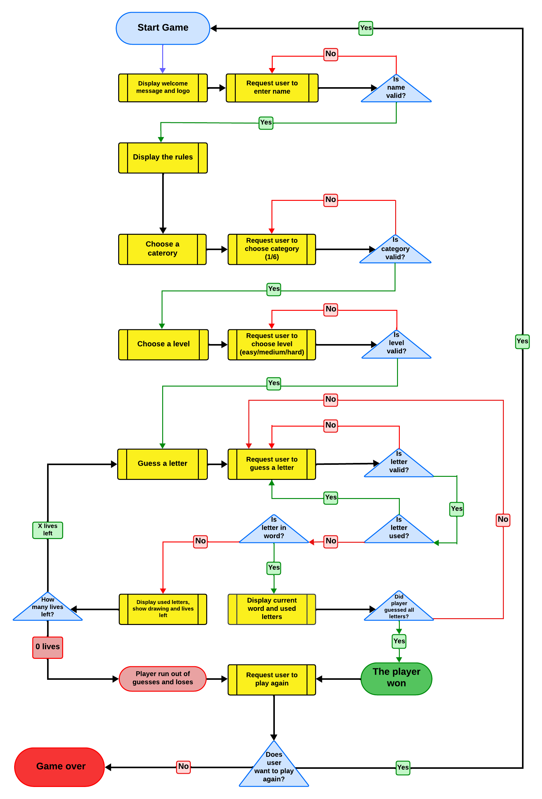
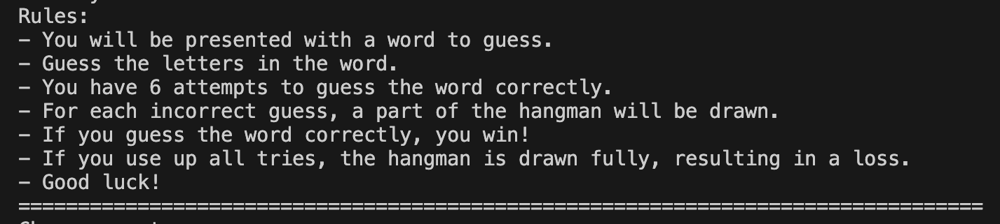
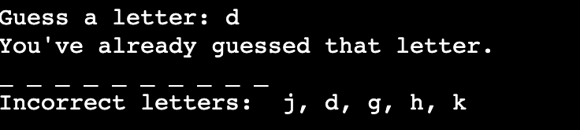

# The Hangman Game

Hangman is the ultimate test of your linguistic prowess, your ability to decipher cryptic messages, and your knack for escaping perilous situations. It's a game that separates the wordsmiths from the wordless wonders and the puny from the pun-masters.

This text-based incarnation of Hangman offers a delightful distraction from the mundane, a chance to pit your wits against a randomly selected word while dangling precariously on the brink of victory or certain doom. Whether you're a cunning linguist, a master of mirth, or just someone looking to procrastinate with purpose, Hangman has something for everyone.

The game runs in the Code Institute's mock terminal on Heroku.

The live link can be found here: [Hangman Game](https://hangman-game-makarets-4c786ce4abe6.herokuapp.com/).

# How to play

This digital version of Hangman retains all the charm and excitement of the classic game, offering players a chance to test their vocabulary skills and strategic thinking in a fun and engaging format. Whether you're a seasoned word enthusiast or just looking for a casual game to pass the time, Hangman promises hours of entertainment and enjoyment.

### Rules of the game

-  You will be presented with a word to guess.
-  Guess the letters in the word.
-  You have 6 attempts to guess the word    correctly.  
-  For each incorrect guess, a part of the hangman will be drawn.
- If you guess the word correctly, you win!
- If you use up all tries, the hangman is drawn fully, resulting in a loss.

## User Experience (UX)

### Clear Instructions

- The game provides clear instructions on how to play, including rules, objectives, and how to interact with the game.

### FlowChart

-  The [flowchart](media/flowchart.png) below illustrates the sequential steps of the hangman guessing game, depicting how users can navigate through the game and the available options at each stage.

## User Stories

  - As a Player, I want to be able to choose a category of words so that I can guess words related to a specific theme.
  - As a User, I want to select the difficulty level (easy, medium, or hard) to adjust the challenge level of the game.
  - As a Player, I want to see a visual representation of the hangman figure as I make incorrect guesses, so I can track my progress.
  - As a User, I want to receive immediate feedback on the game results after making a choice, allowing me to know whether I won, lost, or it was a draw.
  - As a Gamer, I want to be presented with a word to guess, with each letter represented by underscores, so I can start guessing.
  - As a Player, I want immediate feedback after each guess to know whether my guess was correct or incorrect.
  - As a Gamer, I want to see the letters I've already guessed and the incorrect guesses I've made, so I can make informed decisions for my next guess.
  - As a Player, I want to know how many tries I have left before the game ends, so I can strategize my guesses accordingly.
  - As a Player, I want to be notified when I win or lose the game, so I know the outcome of my gameplay.
  - As a Player, I want the option to play again after completing a game, so I can enjoy multiple rounds of gameplay without restarting the application.
  - As a Visitor, I want clear instructions on how to play the game, including rules and controls, so I can easily understand and enjoy the gameplay experience.

## Features

### Existing Features

- __Welcome screen__

  - Welcome screen includes visual elements such as ASCII art for the hangman figure and word display. 
  
  

  - The ability to enter a user name is included to maintain a friendly atmosphere during the game.
  
  

- __Rules of games__

  - The user can familiarize himself with the rules of the game before starting it.
  
  

  - __Choose Category__

  - You will be prompted to choose a category, to provide variety in gameplay.
  - Categories include fruits, animals, programming languages, countries, cities, and colors.
  - Select the category by entering the corresponding numbers.
  
  

- __Choose Level__
  - You will be prompted to choose a level, to provide challenge in gameplay.
  - Levels are categorized as easy, medium, or hard based on word length.
  - Select the level by entering the corresponding numbers.
  
  

- __Guessing Letters__

  - Once the game starts, you will see underscores representing each letter of the hidden word.
  -  Guess a letter by typing it in and pressing enter.
  -  If the letter is correct, it will replace the corresponding underscore(s) in the word.

  

  - If the letter is incorrect, a part of the hangman will be drawn, and the incorrect letter will be displayed.
  -  You can continue guessing letters until you either guess the word correctly or run out of attempts.
  
  

- __Game Outcome__

  - If you correctly guess all the letters in the word before using up all your attempts, you win the game!

  

  - If you use up all your attempts before guessing the word, the hangman is fully drawn, and you lose the game.

  

- __Play Again__

  - After each game, you will be asked if you want to play again.
  - Enter "yes" to play another round or "no" to exit the game.

  

### Features left to implement

- __Add hints to the game that will help players guess the word.__
- __Introducing into the game the ability to track the progress of the player.__
- __For the game to have leaderboards or highscores.__
- __For the game to have multiplayer or online features so that the player can challenge his friends or other players in real-time matches.__
